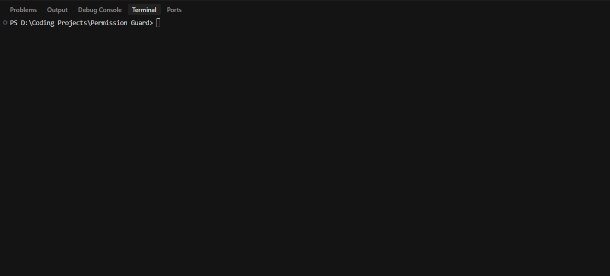

# Permission Guard


[](LICENSE)
[](https://www.npmjs.com/package/@kenjiifx/permissionguard)

Permission Guard is a local-first CLI for identifying overly broad AWS IAM permissions, explaining their risk, and generating safer, reviewable remediation candidates.

The project is deterministic and rules-based. It does **not** use LLM APIs, and it does **not** claim to produce perfect least-privilege policies automatically.

## 30-Second Demo

Scan an intentionally risky IAM policy and get immediate, actionable output.

```bash
npx @kenjiifx/permissionguard scan examples/bad-policy.json
```

Expected result:
- multiple **CRITICAL** findings
- high aggregated risk score
- clear remediation recommendations



## Why This Project Exists

IAM policies often drift into risky patterns over time (`Action: "*"`, `Resource: "*"`, broad service wildcards). Permission Guard helps teams detect this drift quickly and gives concrete, reviewable next steps.

It is designed for:

- security-minded developers
- platform and cloud engineering teams
- CI pipelines that need deterministic behavior

## Discoverability Keywords

Permission Guard is built for use cases commonly searched by developers and cloud teams:

- AWS IAM policy scanner
- IAM least-privilege audit tool
- DevSecOps CLI for permission reviews
- Security linting for IAM JSON policies
- SARIF IAM findings for CI/code scanning

## Core Capabilities

- Parse and normalize IAM JSON policies from file, stdin, or AWS role fetch
- Detect high-risk access patterns with explicit severity
- Compute deterministic `0-100` risk scores
- Generate structured remediation suggestions with confidence levels
- Emit terminal, JSON, and Markdown reports
- Emit SARIF for code scanning integrations
- Support strict CI exits based on finding severity

## Installation

```bash
npm install -g @kenjiifx/permissionguard
```

For local development:

```bash
npm install
npm run build
```

## Quickstart

```bash
# Scan local policy file
permissionguard scan examples/admin-policy.json

# Generate remediation suggestions + candidate policy file
permissionguard suggest examples/broad-s3-policy.json --candidate-output safer-policy.json

# Generate markdown report for PR/security review docs
permissionguard report examples/mixed-policy.json --format markdown --output report.md

# Fetch role policies from AWS and inspect
permissionguard fetch --role MyAppRole

# Scan role policies and fail CI for medium/high/critical findings
permissionguard scan --role MyAppRole --strict

# Scan an entire directory of JSON policies
permissionguard batch ./policies --format markdown --output batch-report.md
```

## Commands

### `permissionguard scan <input>`

Scans a local IAM policy file (or stdin) and prints findings.

Common options:

- `--role <roleName>` scan policies attached to an IAM role
- `--strict` exit non-zero for medium/high/critical findings
- `--fail-on <severity>` custom CI threshold (`low|medium|high|critical`)
- `--min-severity <severity>` suppress lower-severity findings in output
- `--json` emit machine-readable output
- `--output <path>` write report output to file
- `--quiet` suppress terminal output
- `--no-color` disable colored output

### `permissionguard suggest <input>`

Runs scan + risk scoring + suggestion generation.

Options:

- `--candidate-output <path>` write generated candidate policy JSON
- `--output <path>` write report output
- `--min-severity <severity>` filter findings and suggestions by severity
- supports common options (`--role`, `--json`, `--quiet`, `--no-color`)

### `permissionguard report <input> --format terminal|json|markdown|sarif`

Generates findings in terminal, JSON, Markdown, or SARIF output format.

### `permissionguard fetch --role <roleName>`

Fetches inline and attached managed policies for an IAM role (AWS SDK v3).

### `permissionguard explain [ruleId]`

Lists all detection rule IDs, or explains a single rule in detail.

### `permissionguard batch <target>`

Scans all `.json` files in a directory (recursive) or a single file and emits an aggregated report.

Options:

- `--format <terminal|json|markdown>` output format for batch report
- supports common options (`--min-severity`, `--fail-on`, `--output`, `--quiet`)

## Real-World Use Cases

- **Pre-merge IAM checks:** run `scan` or `report --format sarif` in CI and fail on risk thresholds.
- **Incident hardening:** quickly identify broad wildcard access in legacy policies.
- **Migration reviews:** compare old policy docs and candidate safer output during cloud refactors.
- **Platform guardrails:** provide teams deterministic feedback before policy changes are deployed.

### `permissionguard version` / `permissionguard help`

Built-in Commander metadata/help commands.

## Rules in V1

- Wildcard action (`Action: "*"`) - critical
- Wildcard resource (`Resource: "*"`) - high/critical context-aware
- Broad service wildcard (`s3:*`, `ec2:*`, `iam:*`, etc.)
- Sensitive IAM and privilege-escalation actions
- Admin pattern detection (`Allow` + `Action "*"` + `Resource "*"`)
- Excessive broad mutating/write permissions
- Missing resource scoping opportunities
- Missing conditions on risky broad patterns
- Risky `Allow + NotAction` patterns
- Risky `Allow + NotResource` patterns
- Wildcard principal (`Principal: "*"`) exposure

## Risk Scoring and Suggestions

- Deterministic risk score from `0-100`
- Transparent severity weighting and compounding
- Suggestion confidence labels:
  - `safe`
  - `review-needed`
  - `manual-only`
- Candidate rewrites are produced only when confidence is high enough

## Exit Codes

- `0`: success, no strict-mode blocker
- `1`: runtime/input/configuration error
- `2`: strict mode blocker (medium/high findings)
- `3`: strict mode blocker includes critical findings

## Safety Philosophy

Permission Guard is intentionally conservative:
- flag risk early and clearly
- produce reviewable guidance, not silent policy rewrites
- remain local-first by default
- avoid overpromising full least-privilege automation

## Limitations

- V1 is focused on IAM JSON policy analysis
- AWS fetch support currently targets IAM roles
- Suggestions are advisory candidates, not guaranteed deploy-ready policies

## Development

Scripts:

- `npm run build`
- `npm run lint`
- `npm run typecheck`
- `npm run test`
- `npm run ci`
- `npm run format`

## Project Configuration

Permission Guard optionally reads `.permissionguard.json` from the current working directory to set defaults.

Example:

```json
{
  "strict": true,
  "failOn": "high",
  "minSeverity": "medium",
  "reportFormat": "markdown",
  "batchFormat": "json"
}
```

## Governance

- Contributing guide: `CONTRIBUTING.md`
- Code of Conduct: `CODE_OF_CONDUCT.md`
- Security policy: `SECURITY.md`

## License

MIT (`LICENSE`)
